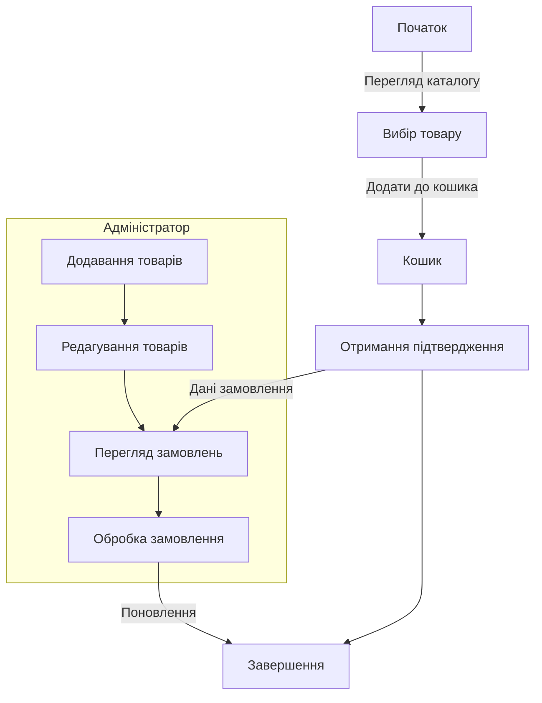

# Lab1

```mermaid
graph TD;
  A[Початок] --> |Перегляд каталогу| B[Вибір товару];
  B --> |Додати до кошика| C[Кошик];
  C --> D[Отримання підтвердження];
  D --> E[Завершення]

  subgraph "Адміністратор"
    F[Додавання товарів] --> G[Редагування товарів];
    G --> H[Перегляд замовлень];
    H --> I[Обробка замовлення];
  end

D --> |Дані замовлення| H;
I --> |Поновлення| E;

```
